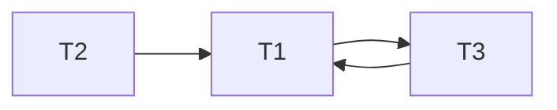

# TD8

## Exercice 1

1. Le **commit** pour valider les changements sur la base de données et le **rollback** pour les annuler.
2. Si on a deux transactions différentes, et qu'une modifie une ressource et que l'autre tente de la modifier, cela pose un problème.
3. Un algorithme optimiste va laisser l'exécution se faire et vérifier si elel est réalisable puis al bloquer en fonction <br>
Un algo pessimiste va mettre en place des systèmes de verrouillages pour tenter de prévenir ces solutions non réalisables.
4. <br>
   1. Vrai car moins de contraintes en non conflictuel <br>
   2. Faux <br>
   3. Faux <br>
   4. Faux, on peut avoir différents enchaînements

Cycle = pas conflictuellement réalisable

## Exercice 2

1. C'est sérializable car T2 effectue toutes ses actions avant T1
2. C'est conflictuellement sérializable.
3. T1 doit être fait avant T2 et T2 doit être fait avant T1, donc ce n'est pas conflictuellement sérializable.
    ```mermaid
    flowchart RL
    T1 --> T2
    T2 --> T1
    ```
4. On écrit le flow de S, puis le flow de l'exécution de T1 puis T2, puis le flow de l'exécution de T2 puis T1. <br>
    Il n'y a pas d'équivalence entre S et T1 -> T2 <br>
    Pas d'équivalence entre S et T2 -> T1 <br>
    Donc non vue sérializable
5. <br>
   1. 

   2. On finit par être bloqué dans les écritures